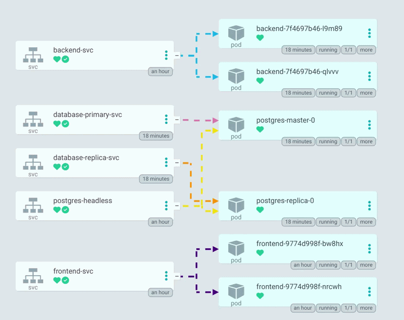

<div align="center">

<h1>KubeCoin Platform Workspace</h1>

<p>
  <strong>Multi-repo DevOps learning workspace</strong><br/>
  Kubernetes, Helm, Terraform, Ansible, CI/CD, and microservices in one place.
</p>


</div>

---

## What This Workspace Contains

This parent repository tracks multiple submodules for the full KubeCoin lifecycle:

- app services (backend + frontend)
- full-stack source with environment-wise Kubernetes manifests
- infrastructure as code (Terraform)
- configuration management (Ansible)
- Helm charts + plain YAML manifests for experiments

## Repository Map

| Path | Role |
|---|---|
| `kubecoin-backend` | Flask API microservice |
| `kubecoin-frontend` | React + Vite UI microservice |
| `kubecoin-project` | Full app source + Docker Compose + Jenkins + K8s env folders |
| `kubecoin-infra` | AWS infra and K8s bootstrap automation |
| `kubecoin-helm-charts` | Helm chart and plain study manifests |

## Demo Preview



## Submodule Commands

```bash
git submodule update --init --recursive
git submodule foreach --recursive git status
```

## Learning Workflow

1. Provision infra in `kubecoin-infra/infra`.
2. Bootstrap clusters in `kubecoin-infra/ansible`.
3. Deploy app using Helm (`kubecoin-helm-charts`) or environment YAMLs (`kubecoin-project/k8s`).
4. Iterate on frontend/backend services.

## Notes

- Each submodule has its own git history and remote.
- Commit and push inside each submodule when changing that module.
- This parent repo only tracks submodule pointers.

## CI/CD Note

- Jenkins pipelines build and push Docker images using the Jenkins credential `docker-creds`.
- Helm image values are updated from CI and pushed back to Git using `git-creds`.
- Image updates target `kubecoin-helm-charts/kubecoin/values.yaml`.
